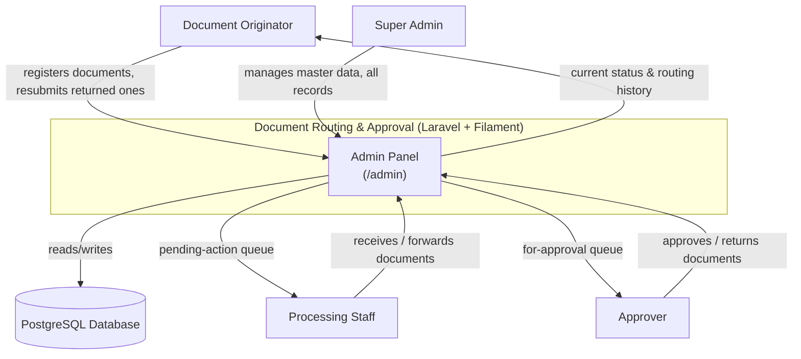
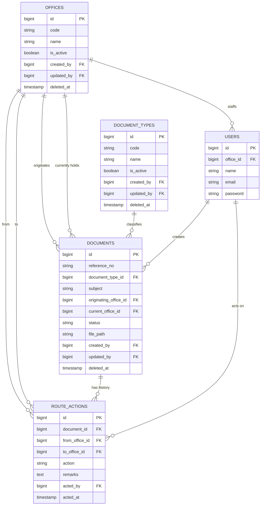
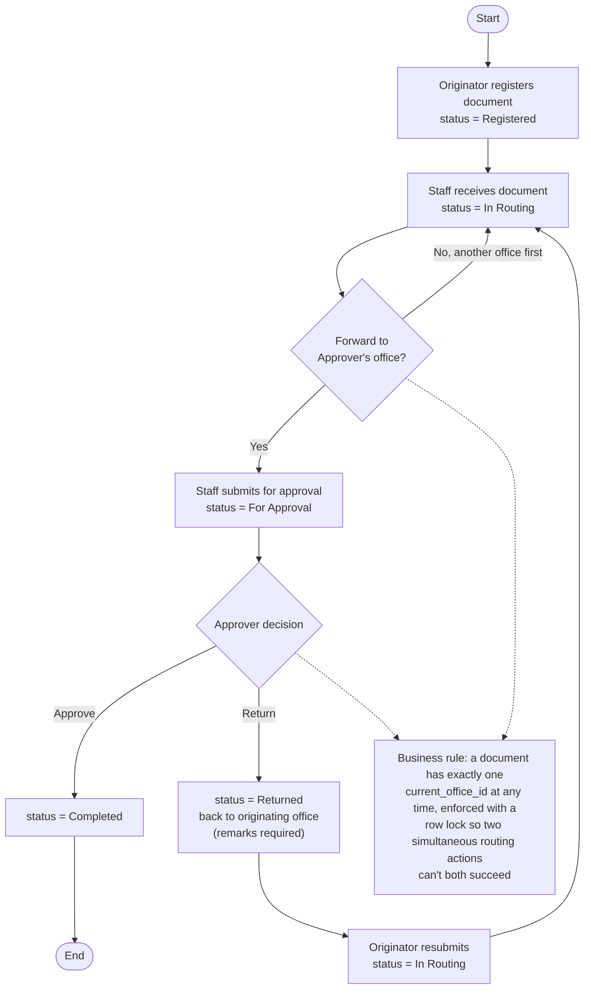
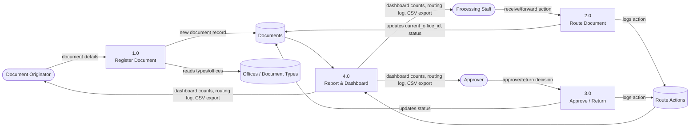

# Case Study 8 — Required Diagrams

These four diagrams describe the MVP as actually implemented (see `database/migrations/`, `app/Models/`, `app/Services/DocumentRoutingService.php`). They supersede `mermaid-diagram.png`, which was drawn against an earlier, larger schema (separate status/action lookup tables, a custom `roles` table, attachments, and history tables) that was never built — the real app uses plain status strings on `documents` and Spatie/Filament Shield for roles.

## 1. System Context Diagram

## 2. Entity Relationship Diagram (ERD)

Matches `database/migrations/2026_09_22_1000*` exactly.

Roles/permissions (`document_originator`, `processing_staff`, `approver`, `super_admin`) are managed by Filament Shield's own `roles`, `permissions`, `model_has_roles` tables and are not modeled as a custom entity.

## 3. Process Flow Diagram

## 4. Data Flow Diagram — Level 0

